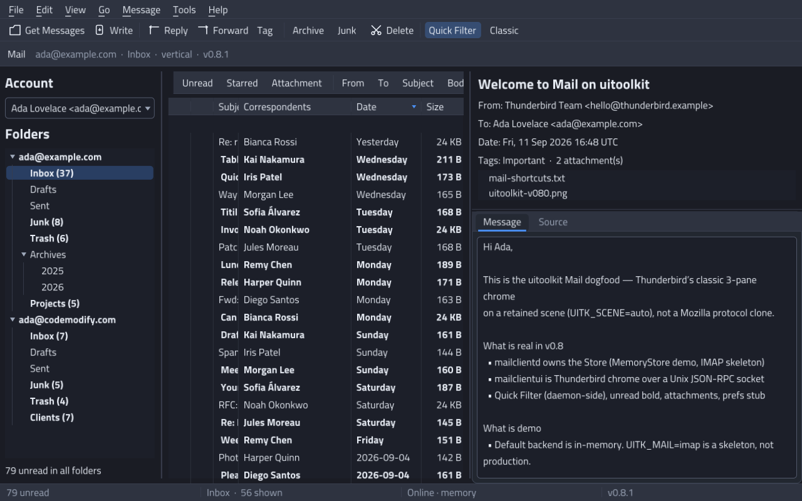

# comms-mail

A desktop mail client for Linux, written in Go. Familiar Thunderbird-shaped
chrome — folder tree, thread list, message preview — over IMAP or POP3 for
receiving and SMTP for sending, with OAuth for Google and Microsoft
accounts and an on-disk cache so the mailbox is there when the network is
not.



## Two processes

comms-mail is split the way a mail client should be: a headless daemon
owns the mail, and a UI process draws it.

| Binary | What it does |
| --- | --- |
| **`comms-maild`** | Accounts, folders, messages, tags, filters, identities, smart folders, VIP, categories, the outbox and search. It is the only process that speaks IMAP, POP3, SMTP or OAuth, and the only one that touches the cache on disk. |
| **`comms-mail`** | The window. It sends JSON-RPC commands over a Unix socket and owns the tray item. It never opens a network connection to a mail server. |
| **`comms-mail-demo`** | Both of the above in one process, over a temp socket, against a seeded in-memory store. For trying it out, for screenshots, and for a quick look without an account. |

They talk NDJSON [JSON-RPC 2.0](https://www.jsonrpc.org/specification) over
a Unix socket. The socket is the daemon's only authorisation boundary, so
it is created `0600` inside a `0700` directory, every connection is checked
against the caller's uid with `SO_PEERCRED`, and a lock file stops a second
daemon from quietly stealing the path.

That split runs all the way down into the source. The daemon links no GUI
code at all:

| Package | Contains | Links a UI toolkit |
| --- | --- | --- |
| [`mailcore`](mailcore) | `Store` and its backends, accounts and folders, MIME, IMAP, POP3, SMTP, OAuth, the protocol and the socket server | no |
| [`mailui`](mailui) | the three-pane window, the compose / account / preferences / filter dialogs, the tray item | yes |

```console
$ go list -deps ./cmd/comms-maild | grep -c uitoolkit
0
```

## Build and run

Go 1.22 or newer. No cgo is required on Linux.

```bash
git clone https://github.com/codemodify/comms-mail
cd comms-mail
go build ./...
```

Try it without an account, in one process:

```bash
go run ./cmd/comms-mail-demo
```

Or run it properly, in two terminals:

```bash
# Terminal 1 — the daemon. Empty until you add an account.
go run ./cmd/comms-maild

# Terminal 2 — the window. It offers to add an account on first run.
go run ./cmd/comms-mail
```

Then **File → Add Account**: type an address and comms-mail fills in the
well-known servers for the big providers, or set the hosts yourself. For
Gmail and Outlook, **Sign in with Google / Microsoft** does OAuth in your
browser and stores an encrypted refresh token instead of a password.
Accounts live in `~/.config/uitoolkit/mail.json`, mode `0600`.

To install the binaries:

```bash
go install github.com/codemodify/comms-mail/cmd/comms-maild@latest
go install github.com/codemodify/comms-mail/cmd/comms-mail@latest
```

### Useful flags and variables

```bash
go run ./cmd/comms-mail -light            # start in the light theme
go run ./cmd/comms-mail -classic          # preview below the thread list
go run ./cmd/comms-mail -headless         # render once to mail.png and exit
go run ./cmd/comms-mail -socket /tmp/x    # a daemon somewhere else

UITK_MAIL=memory  go run ./cmd/comms-maild   # seeded in-memory store
UITK_MAIL_SOCK=/tmp/mail.sock                # where the socket lives
UITK_MAIL_PASS=secret                        # password out of the environment
UITK_MAIL_NO_NOTIFY=1                        # no daemon-side desktop toast
```

The socket defaults to `$UITK_MAIL_SOCK`, else
`$XDG_RUNTIME_DIR/comms-maild.sock`, else `/tmp/comms-maild-<uid>.sock`.

## Tests

Run them through `tools/testenv.sh`, not with a bare `go test`. The UI
tests build real widget trees, and on a desktop machine an unguarded run
reaches the display and the session bus you are sitting in front of.
`testenv.sh` takes away `DISPLAY`, `WAYLAND_DISPLAY` and `WAYLAND_SOCKET`,
gives the tests a private D-Bus session bus that can start no services, and
points every XDG directory at a temp dir.

```bash
tools/testenv.sh go test ./...
```

The tests never touch a real mailbox; see [docs/testing.md](docs/testing.md)
for the rules that keep it that way.

## Built on uitoolkit

The UI is written with [uitoolkit](https://github.com/codemodify/uitoolkit),
a pure-Go desktop widget toolkit — Wayland and X11, its own layout, text
and theming, no GTK or Qt underneath. comms-mail uses only uitoolkit's
exported API:

```console
$ go list -deps ./... | grep uitoolkit | grep internal
$
```

## Documentation

- [docs/mail.md](docs/mail.md) — the long version: protocol, TLS modes,
  OAuth, sync, the outbox, threading, filters, keyboard map, the UI feature
  list.
- [docs/tray.md](docs/tray.md) — the status item and new-mail toasts.
- [docs/testing.md](docs/testing.md) — how to run the tests, and the mail
  safety rules.

## Status

Linux is the target. IMAP with IDLE, QRESYNC and CONDSTORE, POP3, SMTP
with STARTTLS or implicit TLS, OAuth for Google and Microsoft, the offline
outbox, threading, tags, filters, smart folders and full-text search all
work. HTML mail is shown as text: there is no HTML engine, and HTML-only
messages are tag-stripped. Windows and macOS builds exist for the tray only
— the windows are still a stub in the toolkit. See
[docs/mail.md](docs/mail.md) for the honest per-feature state.

## Licence

[The Free License](LICENSE). You are free to use this. No restrictions.
